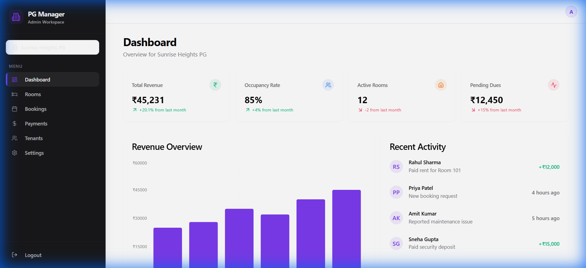
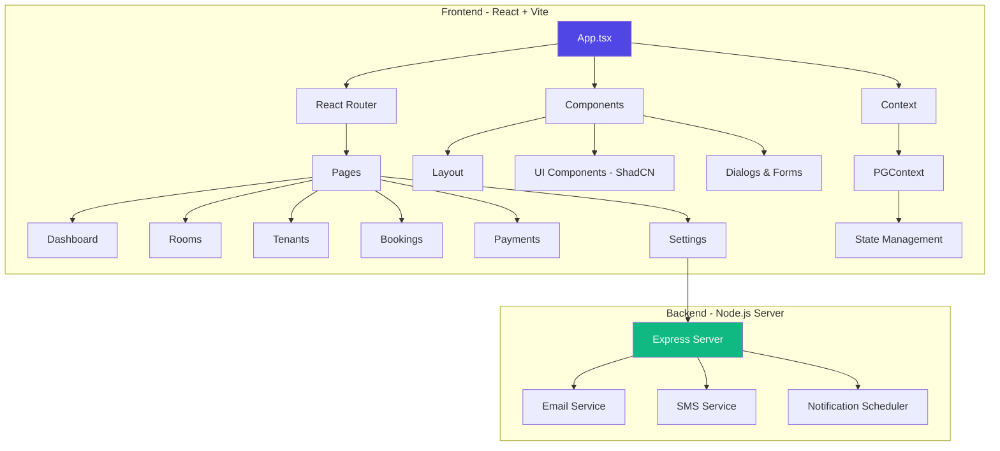
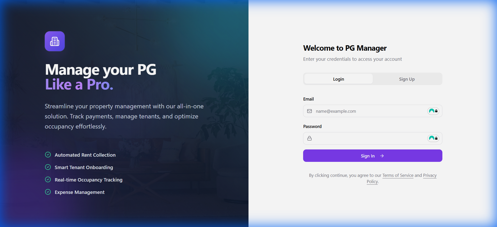
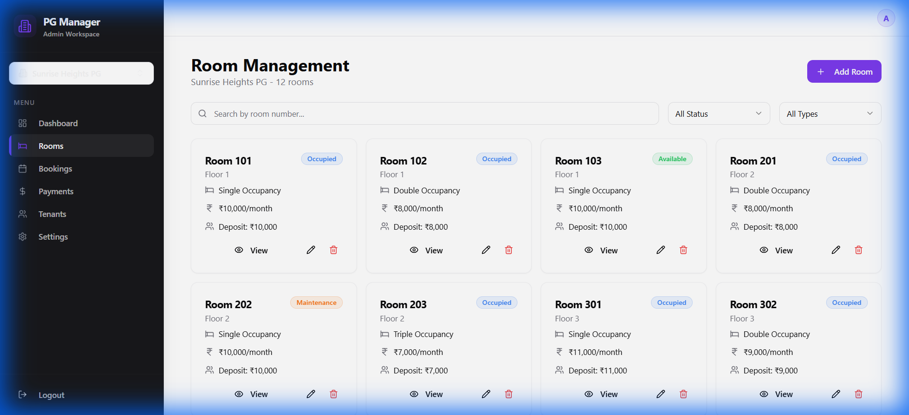
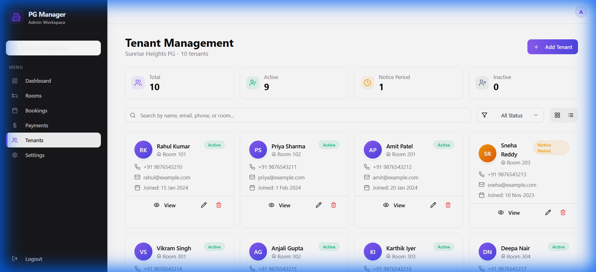
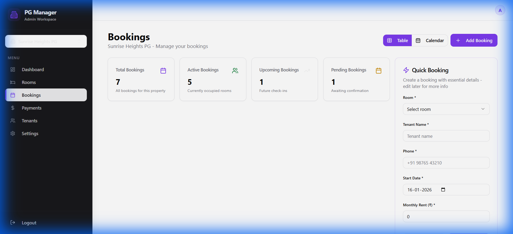
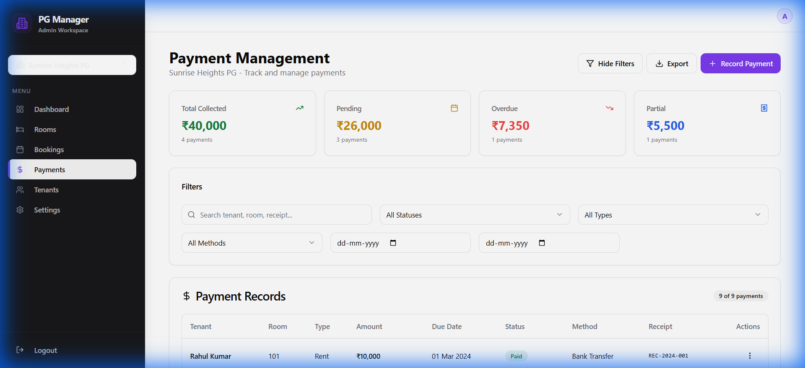
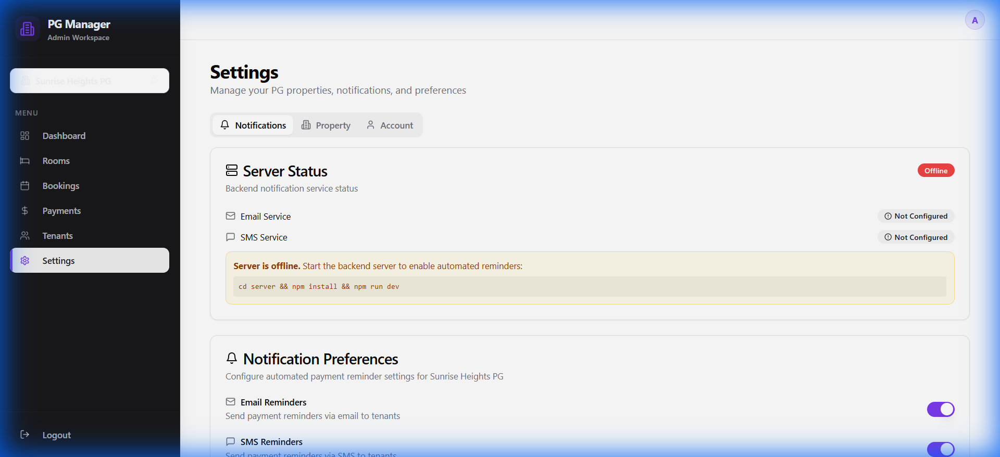

# 🏠 PG Manager Pro

A modern, full-featured **Paying Guest (PG) Management System** built with React, TypeScript, and Tailwind CSS. Streamline your PG operations with automated rent collection, real-time occupancy tracking, and comprehensive tenant management.



## 🎬 Demo


---

## ✨ Features

### 📊 Dashboard
- **Real-time KPIs**: Total revenue, occupancy rate, active rooms, pending dues
- **Revenue Analytics**: Visual bar charts showing monthly revenue trends
- **Activity Feed**: Recent payments, bookings, and maintenance updates

### 🛏️ Room Management
- Add, edit, and manage individual rooms
- Track room status (Occupied, Available, Maintenance)
- Configure occupancy types (Single, Double, Triple)
- Set monthly rent and security deposit amounts

### 👥 Tenant Management
- Complete tenant lifecycle management
- Contact information and documentation
- Status tracking (Active, Notice Period, Inactive)
- Search and filter capabilities

### 📅 Booking System
- Quick booking form for rapid entry
- Calendar and table view options
- Booking status tracking (Active, Upcoming, Completed)
- Multi-PG property support

### 💰 Payment Tracking
- Comprehensive payment records
- Status tracking (Paid, Pending, Overdue, Partial)
- Multiple payment methods support
- Financial summary and analytics

### ⚙️ Settings & Notifications
- Automated rent payment reminders (Email & SMS)
- Configurable notification schedules
- Property and account settings
- Backend server status monitoring

---

## 🏗️ Architecture



### Project Structure

```
pg-manager-pro/
├── src/
│   ├── components/          # Reusable UI components
│   │   ├── ui/              # ShadCN UI components
│   │   ├── Layout.tsx       # Main layout wrapper
│   │   ├── BookingFormDialog.tsx
│   │   ├── PaymentFormDialog.tsx
│   │   └── NotificationSettings.tsx
│   ├── pages/               # Route-based pages
│   │   ├── Auth.tsx         # Login/Register
│   │   ├── Dashboard.tsx    # Overview & Analytics
│   │   ├── Rooms.tsx        # Room Management
│   │   ├── Tenants.tsx      # Tenant Management
│   │   ├── Bookings.tsx     # Booking System
│   │   ├── Payments.tsx     # Payment Tracking
│   │   └── Settings.tsx     # App Configuration
│   ├── context/             # React Context
│   │   └── PGContext.tsx    # Global State Management
│   ├── types/               # TypeScript Definitions
│   ├── data/                # Mock Data
│   └── hooks/               # Custom Hooks
├── server/                  # Backend Server
│   └── (Email/SMS Services)
├── public/                  # Static Assets
└── docs/
    └── images/              # Documentation Images
```

### Data Flow

```mermaid
flowchart LR
    subgraph User["👤 User"]
        UI[Web Interface]
    end
    
    subgraph Frontend["⚛️ React Frontend"]
        Pages --> Context
        Context --> State[Local State]
        State --> MockData[(Mock Data)]
    end
    
    subgraph Backend["🔧 Backend Server"]
        API[REST API]
        Email[Email Service]
        SMS[SMS Service]
    end
    
    UI --> Pages
    Context --> API
    API --> Email
    API --> SMS
```



---

## 🖼️ Screenshots

<details>
<summary><b>📋 Authentication</b></summary>


</details>

<details>
<summary><b>🛏️ Room Management</b></summary>


</details>

<details>
<summary><b>👥 Tenant Management</b></summary>


</details>

<details>
<summary><b>📅 Bookings</b></summary>


</details>

<details>
<summary><b>💰 Payments</b></summary>


</details>

<details>
<summary><b>⚙️ Settings</b></summary>


</details>

---

## 🛠️ Tech Stack

| Category | Technology |
|----------|-----------|
| **Frontend** | React 18, TypeScript, Vite |
| **Styling** | Tailwind CSS, ShadCN UI |
| **State Management** | React Context, TanStack Query |
| **Routing** | React Router v6 |
| **Forms** | React Hook Form, Zod |
| **Charts** | Recharts |
| **Backend** | Node.js, Express |
| **Notifications** | Email (Nodemailer), SMS (Twilio) |

---

## 🚀 Getting Started

### Prerequisites

- Node.js 18+ & npm installed - [install with nvm](https://github.com/nvm-sh/nvm#installing-and-updating)

### Installation

```bash
# Clone the repository
git clone https://github.com/Yash-Kavaiya/pg-manager-pro.git

# Navigate to project directory
cd pg-manager-pro

# Install dependencies
npm install

# Start development server
npm run dev
```

The app will be available at `http://localhost:8080`

### Backend Setup (for Notifications)

```bash
# Navigate to server directory
cd server

# Install backend dependencies
npm install

# Configure environment
cp .env.example .env
# Edit .env with your email and SMS credentials

# Start the backend server
npm run dev
```

---

## 📧 Automated Rent Reminders

PG Manager Pro includes an automated notification system for rent payment reminders.

### Features

- **Email & SMS Notifications**: Automated reminders to tenants
- **Configurable Schedule**: Set days before due date for reminders
- **Overdue Alerts**: Automatic notifications for overdue payments
- **Beautiful Templates**: Professional HTML emails with payment details
- **Manual Testing**: Test notifications with a single click

### Configuration

1. Navigate to **Settings → Notifications**
2. Enable Email and/or SMS notifications
3. Configure reminder schedule (days before due)
4. Test with "Send Test Notification" button

For detailed setup, see [RENT_REMINDERS_SETUP.md](./RENT_REMINDERS_SETUP.md)

---

## 📜 API Schema

### Core Types

```typescript
interface PG {
  id: string;
  name: string;
  address: string;
  totalRooms: number;
}

interface Room {
  id: number;
  pgId: string;
  roomNumber: string;
  floor: number;
  type: 'Single' | 'Double' | 'Triple';
  status: 'Available' | 'Occupied' | 'Maintenance';
  rent: number;
  deposit: number;
}

interface Tenant {
  id: number;
  name: string;
  email: string;
  phone: string;
  roomId: number;
  status: 'Active' | 'Notice Period' | 'Inactive';
  joinDate: string;
}

interface Payment {
  id: number;
  tenantId: number;
  roomId: number;
  amount: number;
  status: 'Paid' | 'Pending' | 'Overdue' | 'Partial';
  dueDate: string;
  paidDate?: string;
  method: 'Cash' | 'UPI' | 'Bank Transfer' | 'Card';
}
```

---

## 🔧 Available Scripts

| Command | Description |
|---------|-------------|
| `npm run dev` | Start development server |
| `npm run build` | Build for production |
| `npm run preview` | Preview production build |
| `npm run lint` | Run ESLint |

---

## 🤝 Contributing

1. Fork the repository
2. Create your feature branch (`git checkout -b feature/amazing-feature`)
3. Commit your changes (`git commit -m 'Add some amazing feature'`)
4. Push to the branch (`git push origin feature/amazing-feature`)
5. Open a Pull Request

---

## 📄 License

This project is open source and available under the [MIT License](LICENSE).

---

## 🙏 Acknowledgments

- [ShadCN UI](https://ui.shadcn.com/) - Beautiful UI components
- [Lucide Icons](https://lucide.dev/) - Icon library
- [Recharts](https://recharts.org/) - Charting library
- [Vite](https://vitejs.dev/) - Next generation frontend tooling

---

<p align="center">
  Made with ❤️ for PG Owners & Property Managers
</p>
