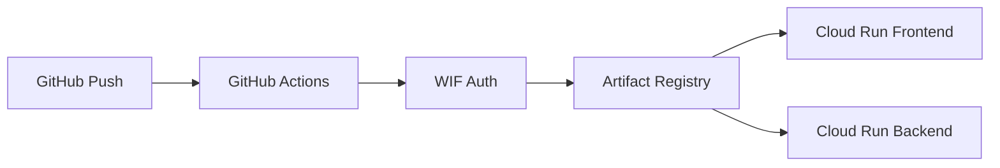

# 🏠 PG Manager Pro

A modern, full-featured **Paying Guest (PG) Management System** built with React, TypeScript, and Tailwind CSS. Streamline your PG operations with automated rent collection, real-time occupancy tracking, and comprehensive tenant management.


## 🎬 Demo


---

## ✨ Features

### 📊 Dashboard
- **Real-time KPIs**: Total revenue, occupancy rate, active rooms, pending dues
- **Revenue Analytics**: Visual bar charts showing monthly revenue trends
- **Activity Feed**: Recent payments, bookings, and maintenance updates

### 🛏️ Room Management
- Add, edit, and manage individual rooms
- Track room status (Occupied, Available, Maintenance)
- Configure occupancy types (Single, Double, Triple)
- Set monthly rent and security deposit amounts

### 👥 Tenant Management
- Complete tenant lifecycle management
- Contact information and documentation
- Status tracking (Active, Notice Period, Inactive)
- Search and filter capabilities

### 📅 Booking System
- Quick booking form for rapid entry
- Calendar and table view options
- Booking status tracking (Active, Upcoming, Completed)
- Multi-PG property support

### 💰 Payment Tracking
- Comprehensive payment records
- Status tracking (Paid, Pending, Overdue, Partial)
- Multiple payment methods support
- Financial summary and analytics

### ⚙️ Settings & Notifications
- Automated rent payment reminders (Email & SMS)
- Configurable notification schedules
- Property and account settings
- Backend server status monitoring

---

## 🏗️ Architecture


### Project Structure

```
pg-manager-pro/
├── src/
│   ├── components/          # Reusable UI components
│   │   ├── ui/              # ShadCN UI components
│   │   ├── Layout.tsx       # Main layout wrapper
│   │   ├── BookingFormDialog.tsx
│   │   ├── PaymentFormDialog.tsx
│   │   └── NotificationSettings.tsx
│   ├── pages/               # Route-based pages
│   │   ├── Auth.tsx         # Login/Register
│   │   ├── Dashboard.tsx    # Overview & Analytics
│   │   ├── Rooms.tsx        # Room Management
│   │   ├── Tenants.tsx      # Tenant Management
│   │   ├── Bookings.tsx     # Booking System
│   │   ├── Payments.tsx     # Payment Tracking
│   │   └── Settings.tsx     # App Configuration
│   ├── context/             # React Context
│   │   └── PGContext.tsx    # Global State Management
│   ├── types/               # TypeScript Definitions
│   ├── data/                # Mock Data
│   └── hooks/               # Custom Hooks
├── server/                  # Backend Server
│   └── (Email/SMS Services)
├── public/                  # Static Assets
└── docs/
    └── images/              # Documentation Images
```

### Data Flow

```mermaid
flowchart LR
    subgraph User["👤 User"]
        UI[Web Interface]
    end
    
    subgraph Frontend["⚛️ React Frontend"]
        Pages --> Context
        Context --> State[Local State]
        State --> MockData[(Mock Data)]
    end
    
    subgraph Backend["🔧 Backend Server"]
        API[REST API]
        Email[Email Service]
        SMS[SMS Service]
    end
    
    UI --> Pages
    Context --> API
    API --> Email
    API --> SMS
```



---

## 🖼️ Screenshots

### 📊 Dashboard


### 🛏️ Room Management


### 📅 Bookings - Table View


### 📅 Bookings - Calendar View


### 💰 Payment Management


### 👥 Tenant Management


### ⚙️ Settings - Notifications


<details>
<summary><b>View More Screenshots</b></summary>

#### Settings - Property


#### Settings - Account


#### Final Dashboard View


</details>

---

## 🛠️ Tech Stack

| Category | Technology |
|----------|-----------|
| **Frontend** | React 18, TypeScript, Vite |
| **Styling** | Tailwind CSS, ShadCN UI |
| **State Management** | React Context, TanStack Query |
| **Routing** | React Router v6 |
| **Forms** | React Hook Form, Zod |
| **Charts** | Recharts |
| **Backend** | Node.js, Express |
| **Notifications** | Email (Nodemailer), SMS (Twilio) |

---

## 🚀 Getting Started

### Prerequisites

- Node.js 18+ & npm installed - [install with nvm](https://github.com/nvm-sh/nvm#installing-and-updating)

### Installation

```bash
# Clone the repository
git clone https://github.com/Yash-Kavaiya/pg-manager-pro.git

# Navigate to project directory
cd pg-manager-pro

# Install dependencies
npm install

# Start development server
npm run dev
```

The app will be available at `http://localhost:8080`

### Backend Setup (for Notifications)

```bash
# Navigate to server directory
cd server

# Install backend dependencies
npm install

# Configure environment
cp .env.example .env
# Edit .env with your email and SMS credentials

# Start the backend server
npm run dev
```

---

## 📧 Automated Rent Reminders

PG Manager Pro includes an automated notification system for rent payment reminders.

### Features

- **Email & SMS Notifications**: Automated reminders to tenants
- **Configurable Schedule**: Set days before due date for reminders
- **Overdue Alerts**: Automatic notifications for overdue payments
- **Beautiful Templates**: Professional HTML emails with payment details
- **Manual Testing**: Test notifications with a single click

### Configuration

1. Navigate to **Settings → Notifications**
2. Enable Email and/or SMS notifications
3. Configure reminder schedule (days before due)
4. Test with "Send Test Notification" button

For detailed setup, see [RENT_REMINDERS_SETUP.md](./RENT_REMINDERS_SETUP.md)

---

## 📜 API Schema

### Core Types

```typescript
interface PG {
  id: string;
  name: string;
  address: string;
  totalRooms: number;
}

interface Room {
  id: number;
  pgId: string;
  roomNumber: string;
  floor: number;
  type: 'Single' | 'Double' | 'Triple';
  status: 'Available' | 'Occupied' | 'Maintenance';
  rent: number;
  deposit: number;
}

interface Tenant {
  id: number;
  name: string;
  email: string;
  phone: string;
  roomId: number;
  status: 'Active' | 'Notice Period' | 'Inactive';
  joinDate: string;
}

interface Payment {
  id: number;
  tenantId: number;
  roomId: number;
  amount: number;
  status: 'Paid' | 'Pending' | 'Overdue' | 'Partial';
  dueDate: string;
  paidDate?: string;
  method: 'Cash' | 'UPI' | 'Bank Transfer' | 'Card';
}
```

---

## ☁️ Cloud Run Deployment

This project includes automated deployment to Google Cloud Run using GitHub Actions with **Workload Identity Federation (WIF)** - no service account keys required!

### Prerequisites

- Google Cloud SDK installed (`gcloud`)
- A GCP Project with billing enabled
- GitHub repository access

### 1. GCP Setup Commands

Run these commands to set up WIF (replace `YOUR_PROJECT_ID` and `YOUR_GITHUB_REPO`):

```bash
# Set variables
export PROJECT_ID="YOUR_PROJECT_ID"
export GITHUB_REPO="Yash-Kavaiya/pg-manager-pro"

# Enable required APIs
gcloud services enable \
  iamcredentials.googleapis.com \
  run.googleapis.com \
  artifactregistry.googleapis.com \
  cloudbuild.googleapis.com

# Create Workload Identity Pool
gcloud iam workload-identity-pools create "github-pool" \
  --project="${PROJECT_ID}" \
  --location="global" \
  --display-name="GitHub Actions Pool"

# Create Workload Identity Provider
gcloud iam workload-identity-pools providers create-oidc "github-provider" \
  --project="${PROJECT_ID}" \
  --location="global" \
  --workload-identity-pool="github-pool" \
  --display-name="GitHub Provider" \
  --attribute-mapping="google.subject=assertion.sub,attribute.actor=assertion.actor,attribute.repository=assertion.repository" \
  --issuer-uri="https://token.actions.githubusercontent.com"

# Create Service Account
gcloud iam service-accounts create "github-actions-sa" \
  --project="${PROJECT_ID}" \
  --display-name="GitHub Actions Service Account"

# Grant permissions
gcloud projects add-iam-policy-binding "${PROJECT_ID}" \
  --member="serviceAccount:github-actions-sa@${PROJECT_ID}.iam.gserviceaccount.com" \
  --role="roles/run.admin"

gcloud projects add-iam-policy-binding "${PROJECT_ID}" \
  --member="serviceAccount:github-actions-sa@${PROJECT_ID}.iam.gserviceaccount.com" \
  --role="roles/artifactregistry.admin"

gcloud projects add-iam-policy-binding "${PROJECT_ID}" \
  --member="serviceAccount:github-actions-sa@${PROJECT_ID}.iam.gserviceaccount.com" \
  --role="roles/iam.serviceAccountUser"

# Get Project Number
PROJECT_NUMBER=$(gcloud projects describe ${PROJECT_ID} --format="value(projectNumber)")

# Allow GitHub to impersonate Service Account
gcloud iam service-accounts add-iam-policy-binding \
  "github-actions-sa@${PROJECT_ID}.iam.gserviceaccount.com" \
  --project="${PROJECT_ID}" \
  --role="roles/iam.workloadIdentityUser" \
  --member="principalSet://iam.googleapis.com/projects/${PROJECT_NUMBER}/locations/global/workloadIdentityPools/github-pool/attribute.repository/${GITHUB_REPO}"

# Create Artifact Registry repository
gcloud artifacts repositories create "pg-manager-pro" \
  --repository-format=docker \
  --location="us-central1" \
  --description="PG Manager Pro Docker images"
```

### 2. GitHub Secrets Configuration

Add these secrets in your GitHub repository (Settings → Secrets → Actions):

| Secret Name | Value |
|-------------|-------|
| `GCP_PROJECT_ID` | Your GCP project ID |
| `GCP_WIF_PROVIDER` | `projects/PROJECT_NUMBER/locations/global/workloadIdentityPools/github-pool/providers/github-provider` |

### 3. Deploy

Push to the `main` branch or manually trigger the workflow:

```bash
git push origin main
```

The GitHub Action will:
1. Authenticate using WIF (no keys!)
2. Build Docker images for frontend and backend
3. Push to Artifact Registry
4. Deploy to Cloud Run

### Deployment Architecture



---

## 🧪 Testing

The application has been comprehensively tested using Playwright MCP. All test results and screenshots are available in the `test-log/` directory.

### Test Coverage
- ✅ Authentication & Login Flow
- ✅ Dashboard with KPIs and Charts
- ✅ Room Management (12 rooms)
- ✅ Booking System (Table & Calendar views)
- ✅ Payment Tracking
- ✅ Tenant Management
- ✅ Settings & Configuration

View the complete test report: [TEST_REPORT.md](test-log/TEST_REPORT.md)

---

## 🔧 Available Scripts

| Command | Description |
|---------|-------------|
| `npm run dev` | Start development server |
| `npm run build` | Build for production |
| `npm run preview` | Preview production build |
| `npm run lint` | Run ESLint |

---

## 🤝 Contributing

1. Fork the repository
2. Create your feature branch (`git checkout -b feature/amazing-feature`)
3. Commit your changes (`git commit -m 'Add some amazing feature'`)
4. Push to the branch (`git push origin feature/amazing-feature`)
5. Open a Pull Request

---

## 📄 License

This project is open source and available under the [MIT License](LICENSE).

---

## 🙏 Acknowledgments

- [ShadCN UI](https://ui.shadcn.com/) - Beautiful UI components
- [Lucide Icons](https://lucide.dev/) - Icon library
- [Recharts](https://recharts.org/) - Charting library
- [Vite](https://vitejs.dev/) - Next generation frontend tooling

---

<p align="center">
  Made with ❤️ for PG Owners & Property Managers
</p>
